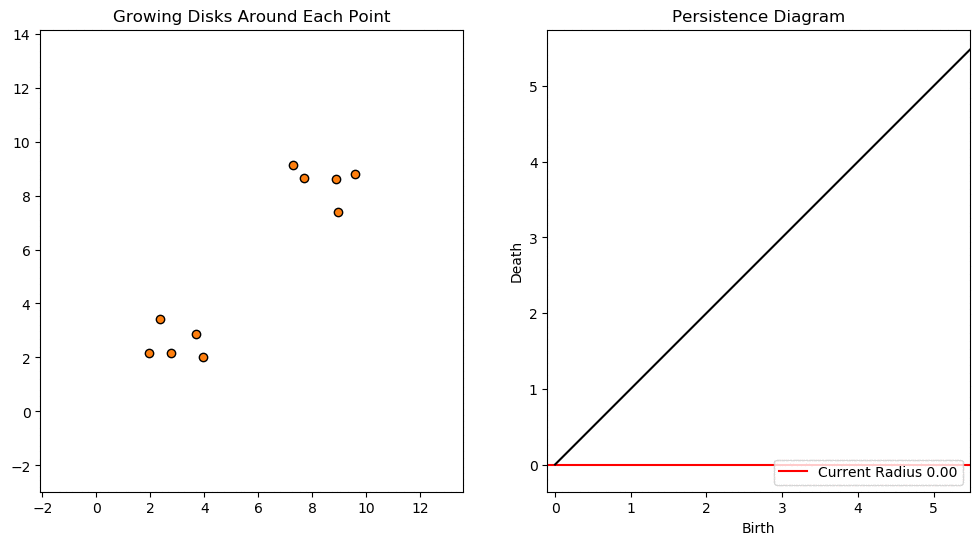
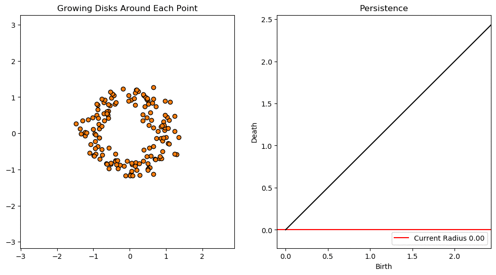
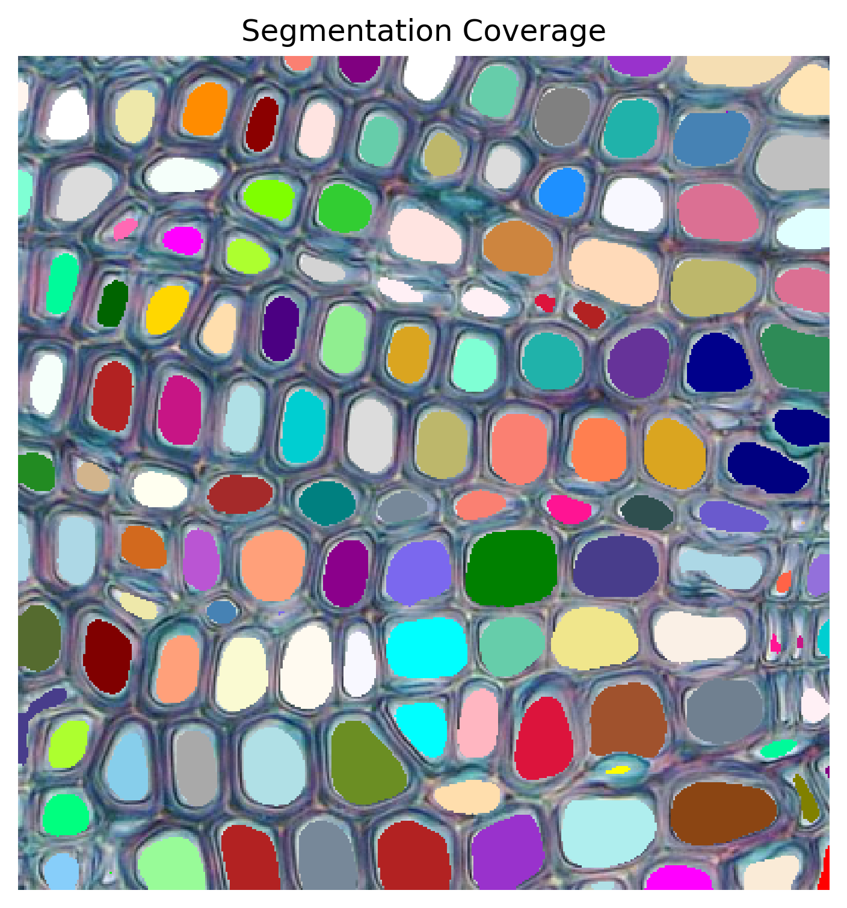

# Persistent Homology Examples

This repo exists to hold interactive html widgets referenced in my Towards Data Science Medium article.

Unfortunately, I cannot share code, as that belongs to my employer (Geometric Data Analytics). I can say that all the code is Python.

The Persistent Homology Calculations were done using my employer's open source Topological Data Analysis package `gda-public`, which is available [here](https://github.com/geomdata/gda-public).

All my visualizations were generated using `matplotlib` and `holoviews`.

# 0d Persistent Homology Example

In the article, I include a gif showing connected components, with each color representing a unique component at a given threshold:

The widget referenced below allows you to see the thresholds covered in the gif, but with interactive control of the threshold:

<a href="https://gjkoplik.github.io/pers-hom-examples/0d_pers_2d_data_widget.html" title="0d pers Widget">Click here for the 0d peristent homology widget</a>

# 1d Persistent Homology Example

In the article, I include a gif showing 1d persistence values for a noisy circle of data:

The widget referenced below allows you to see the thresholds covered in the gif, but with interactive control of the threshold:

<a href="https://gjkoplik.github.io/pers-hom-examples/1d_pers_2d_data_widget.html" title="1d pers Widget">Click here for the 1d peristent homology widget</a>

# Height Filtration Segmentation Example

In the article, I include a static image from running the height filtration up to a specified threshold:

The widget referenced below allows you to see the connected components that form running the height filtration to aribtrary values:

<a href="https://gjkoplik.github.io/pers-hom-examples/segmentation_lowerstar_widget.html" title="Segmentation Widget">Click here for the segmentation widget</a>
